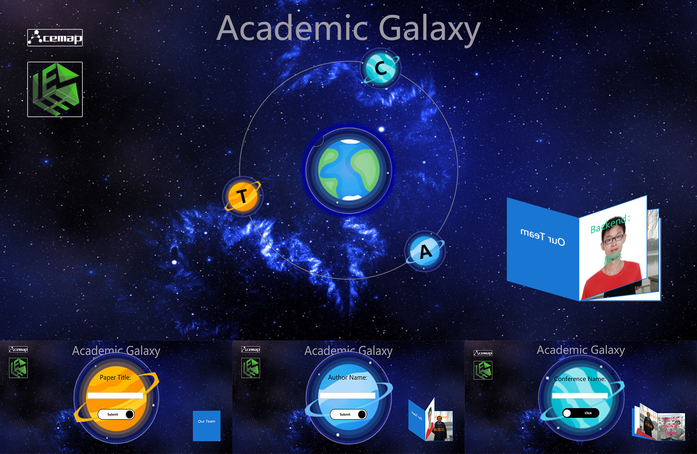
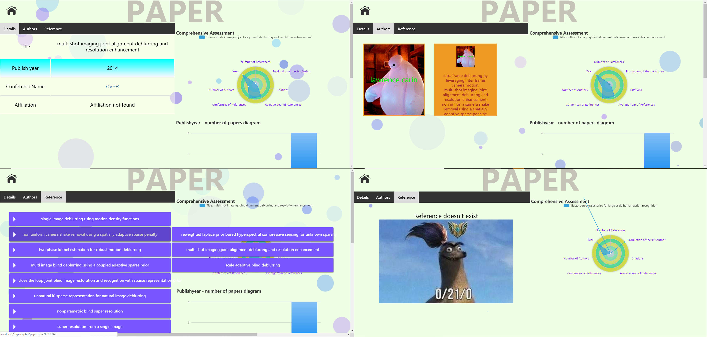

# Academic Search Engine

Developed the front end of the website by establishing a database on MySQL and matched searches based on Solr by HTML, CSS, JavaScript language.
Implemented a local search engine with the capacity to search 5,000 downloaded papers.
Empowered the engine to complete accurate matching and visualize the authors’ information (with a search speed within 0.1s).

## Requirements

### Python lib

PyMySQL version 0.0.3

pysolr version 3.8.1

### Tools

MySQL WorkBench

Java

Apache Solr

## Getting Started

### database

Read report ./MySQL/lab1_report.pdf and run code in ./MySQL/code.

### search engine

Read report ./Solr/lab2_report.pdf and run code in ./Solr/code.

### web example

Read report ./web_development/lab3_report.pdf

### final website

Read report ./website/final_report.pdf and run code in ./website/code.

## Preview

### Home Page

### Search Page

### Detail Page

